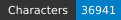
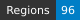
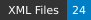

# HTRogène - Medieval French

<table border="0" width="100%" style="width: 100%; border:0;">
  <tr>
    <td align="left"></td>
    <td align="right"></td>
  </tr>
</table>

   

## Introduction

HTRogène is an exploratory project funded by Biblissima+, aiming to develop generic models for automatic transcription of medieval and early modern manuscripts.  
This repository focuses on the Medieval French corpus, providing ground-truth data for Handwritten Text Recognition (HTR) and layout segmentation.  
The dataset is designed to support the creation of robust and reliable HTR models for French manuscripts.

| Shelfmark             | Links                                             | Type   |   Century | Color Pages   |   Main Zones |   Lines |   Characters | Genre      |
|-----------------------|---------------------------------------------------|--------|-----------|---------------|--------------|---------|--------------|------------|
| Paris, BnF, NAF 4503  | [**B**](https://data.biblissima.fr/entity/Q68579) | verse  |        12 | ✗             |           10 |     292 |         9304 | Narratives |
| Paris, BnF, fr. 146   | [**B**](https://data.biblissima.fr/entity/Q46690) | verse  |        14 | ✗             |           12 |     414 |        10355 | Narratives |
| Paris, BnF, fr. 12563 | [**B**](https://data.biblissima.fr/entity/Q45996) | verse  |        15 | ✗             |           10 |     271 |         8641 | Narratives |
| Paris, BnF, fr. 12575 | [**B**](https://data.biblissima.fr/entity/Q46007) | verse  |        15 | ✗             |           10 |     263 |         6181 | Narratives |

## Dataset Overview

The dataset comprises carefully selected manuscripts, each containing approximately 10 columns of text (equivalent to 5 bi-column pages or 10 single-column pages).  
The data adheres to the Segmonto guidelines, ensuring consistency and compatibility with other datasets following the same standards.  
Each image is accompanied by two XML files:

- Files suffixed with `.chocomufin.xml` are normalized for compliance with broader datasets.
- The other XML files contain repository-specific information.

We recommend using the normalized `.chocomufin.xml` files for most applications.

### Total number of pages

29

### Regions

- MainZone (42)
- NumberingZone (17)
- DecorationZone (1)
- DropCapitalZone (32)
- MarginTextZone (3)
- GraphicZone (1)

### Lines

- DefaultLine (1217)
- HeadingLine (1)
- InterlinearLine (22)

## Funding and Support

This project is funded by Biblissima+, an observatory for medieval and Renaissance written cultural heritage.  
Biblissima+ focuses on the study of the circulation of books and the transmission of texts from the 8th to 18th centuries.  
Learn more at the [Biblissima+ project page](https://projet.biblissima.fr/fr/appels-projets/projets-retenus/htrogene).

## License

This dataset is licensed under the Creative Commons Attribution 4.0 International License (CC BY 4.0).  
You are free to share and adapt the material, provided appropriate credit is given.

## Citation

If you use this dataset in your research, please cite it as follows:

<!--Alba, Rachele; Rubin, Giorgia. (2023). HTRogene, Medieval Italian corpus of ground-truth for Handwritten Text Recognition and Layout Segmentation. Zenodo. https://doi.org/10.5281/zenodo.8272728-->

## Acknowledgments

We extend our gratitude to the transcribers and supervisors who contributed to the creation of this dataset.  

Special thanks to Biblissima+ for their financial support and commitment to advancing the study of medieval manuscripts.

For more information about the HTRogène project and other related resources, please visit the [Biblissima+ project page](https://projet.biblissima.fr/fr/appels-projets/projets-retenus/htrogene).

